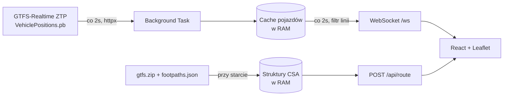
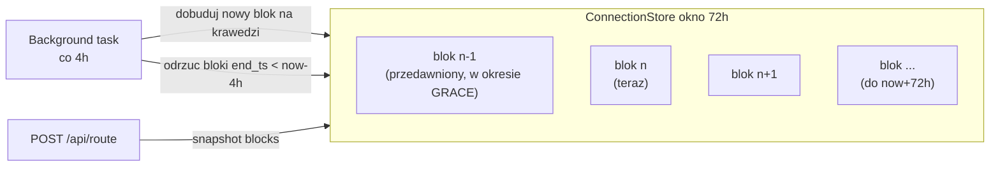

# Specyfikacja projektu: mpk-overseer

> Aplikacja webowa SPA do śledzenia w czasie rzeczywistym pojazdów komunikacji
> miejskiej w Krakowie (GTFS-Realtime) oraz wyszukiwania połączeń przesiadkowych
> z dojściami pieszymi przy użyciu algorytmu Connection Scan Algorithm (CSA).

**Charakter projektu:** mały projekt zabawkowy / edukacyjny. Nie jest przeznaczony
na produkcję. Priorytetem jest prostota i czytelność, a nie skalowalność,
bezpieczeństwo czy odporność na awarie.

> **Legenda:** sekcje oznaczone jako **[ZAŁOŻENIE]** to decyzje doprecyzowane
> ponad tekst źródłowy — można je zmienić w trakcie implementacji.

---

## 1. Przegląd projektu

Aplikacja składa się z dwóch części:

- **Backend (FastAPI)** — wczytuje statyczny GTFS do pamięci RAM, cyklicznie
  pobiera pozycje pojazdów z GTFS-Realtime, streamuje je przez WebSocket oraz
  udostępnia endpoint do wyznaczania trasy (CSA).
- **Frontend (React + Leaflet)** — wyświetla mapę z płynnie animowanymi markerami
  pojazdów, pozwala filtrować linie oraz wyszukiwać połączenia przesiadkowe.



---

## 2. Stack technologiczny

- **Backend:** Python 3.11+, FastAPI, Uvicorn, `gtfs-realtime-bindings`, `httpx`
- **Frontend:** React (Vite, TypeScript), Tailwind CSS, shadcn/ui, Leaflet (`react-leaflet`)
- **Komunikacja realtime:** WebSockets (wbudowane w FastAPI + natywne `WebSocket` API w React)
- **Deployment:** Docker, Docker Compose (jeden wielokontenerowy zestaw)
- **[ZAŁOŻENIE] Serwowanie frontendu:** Vite dev-server (prostsze dla projektu zabawkowego; bez buildu produkcyjnego i Nginx).

---

## 3. Struktura katalogów

```text
mpk-overseer/
├── backend/
│   ├── app/
│   │   ├── __init__.py
│   │   ├── main.py             # Punkt startowy FastAPI, WebSocket, background task
│   │   ├── csa.py              # Implementacja CSA (Earliest Arrival Time)
│   │   ├── gtfs_loader.py      # Ładowanie GTFS z ZIP do RAM + kalendarz serwisów
│   │   ├── blocks.py           # [ZAŁOŻENIE] Generator bloków Connection + ConnectionStore (4.3)
│   │   ├── models.py           # [ZAŁOŻENIE] Modele Pydantic + dataclassy (Connection, Vehicle, RouteRequest)
│   │   └── config.py
│   ├── scripts/
│   │   └── precompute_footpaths.py  # Jednorazowe generowanie ścieżek pieszych (do 30 min, bez CLI)
│   ├── data/
│   │   ├── gtfs.zip            # Statyczna paczka GTFS pobrana z ZTP Kraków
│   │   └── footpaths.json      # Wygenerowany plik przesiadek pieszych
│   ├── Dockerfile
│   └── requirements.txt
├── frontend/
│   ├── src/
│   │   ├── components/
│   │   │   ├── Map.tsx         # Główny komponent mapy Leaflet
│   │   │   ├── VehicleMarker.tsx # Marker pojazdu z animacją LERP
│   │   │   ├── StopMarker.tsx  # Marker przystanku (ikony tram/bus/mixed) + popup odjazdów
│   │   │   ├── Sidebar.tsx     # Panel wyszukiwarki i filtrów
│   │   │   └── ui/             # Komponenty shadcn/ui (button, input, card, slider...)
│   │   ├── context/
│   │   │   └── AppContext.tsx  # Globalny stan (filtry linii, wyniki wyszukiwania)
│   │   ├── hooks/
│   │   │   └── useVehicleSocket.ts # [ZAŁOŻENIE] Hook obsługi WebSocket
│   │   ├── lib/
│   │   │   └── api.ts          # [ZAŁOŻENIE] Wywołania REST (POST /api/route)
│   │   ├── App.tsx
│   │   └── main.tsx
│   ├── Dockerfile
│   ├── package.json
│   ├── vite.config.ts
│   └── tailwind.config.js
└── docker-compose.yml
```

---

## 4. Przygotowanie danych (Data Pipeline)

### 4.1. Statyczny GTFS (wersja in-memory)

Przy starcie aplikacji FastAPI parsuje pliki `.txt` z `backend/data/gtfs.zip`
bezpośrednio do struktur danych w pamięci RAM (słowniki, listy). Wykorzystywane
pliki:

- `stops.txt` — przystanki (id, nazwa, lat, lon)
- `routes.txt` — linie (id, oznaczenie, typ pojazdu)
- `trips.txt` — kursy (powiązanie route ↔ trip ↔ `service_id`)
- `stop_times.txt` — czasy odjazdów/przyjazdów na przystankach
- `calendar.txt` + `calendar_dates.txt` — kalendarz serwisów (które kursy
  jeżdżą w które dni; potrzebny do generowania bloków na przyszłe dni — patrz 4.3)

Z surowego GTFS budujemy w RAM struktury pomocnicze (indeksy), które posłużą do
**generowania bloków `Connection`** dla konkretnego zakresu dat (sekcja 4.3):

- `stops` — słownik `stop_id → Stop`
- `routes`, `trips` — słowniki + mapy `trip_id → route_short_name`, `trip_id → service_id`,
  `route_id → route_type` (GTFS: `0` = tramwaj, `3` = autobus)
- `stop_times_by_trip` — `trip_id → posortowana lista StopTime`
- `service_dates` — `service_id → zbiór dat (date)`, rozwinięty z `calendar.txt`
  (zakres dat + dni tygodnia) i skorygowany przez `calendar_dates.txt`
  (wyjątki: dodanie/usunięcie dnia)
- `stop_lines` — `stop_id → zbiór linii (route_short_name)` przejeżdżających przez
  przystanek (do popupu odjazdów i ikon)
- `stop_kind` — `stop_id → {"tram" | "bus" | "mixed"}` wyznaczony z `route_type`
  linii obsługujących przystanek (tylko tramwaje → `tram`, tylko autobusy → `bus`,
  oba → `mixed`)

**Struktura danych dla CSA (na potrzeby query):** płaska tablica struktur typu
`Connection`, posortowana **rosnąco po czasie odjazdu** (`departure_ts`). Tablica
ta nie jest jednak budowana raz na starcie — powstaje z **rotujących bloków**
pokrywających ruchome okno czasowe (patrz 4.3).

**[ZAŁOŻENIE] Model `Connection` (czas absolutny):**

```python
@dataclass
class Connection:
    departure_stop: str
    arrival_stop: str
    departure_ts: int      # absolutny epoch (sekundy UTC)
    arrival_ts: int        # absolutny epoch (sekundy UTC)
    trip_id: str
    route_short_name: str  # np. "50" — do prezentacji etapu
```

**[ZAŁOŻENIE] Obsługa czasu — model wielodniowy:**

- Ponieważ aplikacja działa długo (dni/tygodnie), `Connection` używa **czasu
  absolutnego (epoch)**, a nie „sekund od północy".
- Czasy GTFS bywają > 24h (np. `25:30:00`) — należą do dnia serwisowego, w którym
  kurs się zaczyna. Czas absolutny liczymy jako:
  `midnight(service_date, tz=Europe/Warsaw) + seconds_from_midnight`, z poprawnym
  uwzględnieniem strefy i przejść czasu letni/zimowy.
- `seconds_from_midnight` parsujemy bez modulo 24h (wartości ≥ 86400 są poprawne).
- Strefa odniesienia: **Europe/Warsaw**; wewnętrznie przechowujemy epoch UTC.

### 4.2. Skrypt `precompute_footpaths.py`

Skrypt uruchamiany **jednorazowo**, bez argumentów CLI — wszystkie ścieżki
(paczka wejściowa, plik wyjściowy, próg czasu) są zaszyte na stałe w skrypcie:

- wejście: `backend/data/gtfs.zip`
- wyjście: `backend/data/footpaths.json`

Działanie:

1. Parsuje `stops.txt` z `backend/data/gtfs.zip`.
2. Oblicza odległość w linii prostej między parami przystanków (wzór **Haversine**).
3. Zakłada prędkość marszu 5 km/h (~83 m/min). Generuje **wszystkie pary** o czasie
   dojścia ≤ **30 minut** (dystans ≤ **2500 m**). Szerszy próg w pliku pozwala
   aplikacji filtrować w czasie zapytania dowolnym `max_walk_time_mins` bez
   regenerowania pliku.
4. Zapisuje wynik do `backend/data/footpaths.json`.

> **Uwaga:** `footpaths.json` zawiera ścieżki do 30 min, ale reszta aplikacji i
> tak filtruje je per zapytanie progiem `max_walk_time_mins` (domyślnie **5 min**,
> zakres 1–5 — patrz 5.3).

**Format `footpaths.json`:**

```json
{
  "stop_id_source": [
    {"target": "stop_id_target_1", "duration_seconds": 180},
    {"target": "stop_id_target_2", "duration_seconds": 240}
  ]
}
```

**[ZAŁOŻENIE] Szczegóły:**

- `duration_seconds = round(distance_m / 83 * 60)`.
- Próg generowania na stałe: 30 min (`MAX_WALK_MINS = 30`, dystans ≤ 2500 m).
- Relacja symetryczna: jeśli A→B istnieje, dodajemy też B→A.
- Pomijamy pary o dystansie 0 (ten sam przystanek) — brak self-loopów.
- Brak argumentów CLI — skrypt uruchamiany raz, parametry zaszyte na stałe.
- Złożoność O(n²) po przystankach jest akceptowalna dla tego projektu.

### 4.3. Rotujące bloki `Connection` (długie działanie aplikacji)

**Problem:** model jednodniowy nie wystarcza, gdy aplikacja działa wiele dni.
Tablica `Connection` musi zawsze pokrywać najbliższą przyszłość, a stare,
nieużywane połączenia trzeba „zapominać", żeby nie rosło zużycie RAM.

**[ZAŁOŻENIE] Parametry okna (z ustaleń):**

- `HORIZON = 72h` — w każdej chwili dostępne są połączenia odjeżdżające w zakresie
  `[now, now + 72h]`.
- `REGEN_INTERVAL = 4h` — co 4 godziny background task generuje nowy blok
  rozszerzający horyzont, tak aby okno wciąż sięgało `now + 72h`.
- `GRACE = 4h` — stary blok usuwamy z pamięci dopiero **4h po jego przedawnieniu**
  (gdy `block.end_ts < now - 4h`), żeby zapytania o niedawną przeszłość nadal działały.

**[ZAŁOŻENIE] Model bloku i magazynu:**

```python
@dataclass
class ConnectionBlock:
    start_ts: int                 # początek slice'a (epoch)
    end_ts: int                   # koniec slice'a (epoch)
    connections: list[Connection] # posortowane rosnąco po departure_ts

class ConnectionStore:
    blocks: tuple[ConnectionBlock, ...]  # rozłączne, uporządkowane chronologicznie
```

- Każdy blok pokrywa rozłączny `slice` czasu (np. dobę serwisową albo okno
  `REGEN_INTERVAL`). Bloki są rozłączne i ułożone chronologicznie, więc
  **konkatenacja bloków jest globalnie posortowana po `departure_ts`** — CSA może
  iterować po blokach po kolei bez ponownego sortowania.

**[ZAŁOŻENIE] Generowanie bloku (dla zakresu `[start_ts, end_ts]`):**

1. Wyznacz dni (daty) przecinające zakres.
2. Dla każdej daty pobierz aktywne `service_id` z `service_dates` (calendar +
   calendar_dates).
3. Dla każdego `trip_id` z aktywnym serwisem rozwiń kolejne pary `StopTime` w
   `Connection` z czasem absolutnym; odfiltruj połączenia poza `[start_ts, end_ts]`.
4. Posortuj `connections` bloku rosnąco po `departure_ts`.

**[ZAŁOŻENIE] Atomowa podmiana (thread-safety):**

- Magazyn trzyma `blocks` jako niemodyfikowalną krotkę. Regeneracja buduje **nową**
  krotkę (dorzuca świeży blok, odrzuca przedawnione wg `GRACE`) i podmienia
  referencję jednym przypisaniem (atomowe dzięki GIL).
- Zapytanie CSA na początku robi „snapshot" referencji `store.blocks` i pracuje na
  spójnym, niezmiennym widoku — nawet jeśli w trakcie nastąpi podmiana.



---

## 5. Backend (FastAPI)

### 5.1. Background Task (GTFS-Realtime)

- Asynchroniczny task uruchamiany przy starcie aplikacji (lifespan / `startup`).
- Co **2 sekundy** pobiera plik binarny z
  `https://gtfs.ztp.krakow.pl/VehiclePositions.pb` (przez `httpx.AsyncClient`).
- Dekoduje go `gtfs-realtime-bindings` (`FeedMessage`).
- Aktualizuje globalną listę/słownik obiektów pojazdów w pamięci serwera.

**[ZAŁOŻENIE] Model pojazdu wysyłany do klienta:**

```json
{
  "vehicle_id": "string",
  "route_id": "string",
  "line": "50",
  "lat": 50.06,
  "lng": 19.94,
  "bearing": 180.0,
  "timestamp": 1719240000
}
```

**[ZAŁOŻENIE] Obsługa błędów:** w razie błędu pobrania/dekodowania task loguje
ostrzeżenie i ponawia próbę w kolejnym cyklu (zachowuje ostatnie znane pozycje).

### 5.1b. Background Task (regeneracja bloków `Connection`)

Drugi asynchroniczny task (patrz 4.3) utrzymuje okno `Connection`:

- Przy starcie wypełnia okno `[now, now + HORIZON(72h)]` początkowymi blokami.
- Co `REGEN_INTERVAL(4h)` dobudowuje nowy blok na krawędzi horyzontu i odrzuca
  bloki przedawnione (`end_ts < now - GRACE(4h)`).
- Buduje nową krotkę `blocks` i atomowo podmienia referencję w `ConnectionStore`.

**[ZAŁOŻENIE]** Generowanie bloków jest CPU-bound (rozwijanie tripów) — uruchamiane
przez `run_in_executor` / `asyncio.to_thread`, żeby nie blokować pętli zdarzeń.

### 5.2. WebSocket `/ws` (streaming + filtrowanie)

- Utrzymuje otwarte połączenie z frontendem.
- Klient może wysłać wiadomość JSON z filtrem linii:
  `{"filter": ["50", "18"]}`. Pusty filtr `[]` = subskrypcja wszystkich linii.
- Backend co **2 sekundy** filtruje globalną listę pojazdów zgodnie z preferencją
  danego socketu i wypycha JSON do klienta.

**[ZAŁOŻENIE] Format wiadomości push:**

```json
{ "type": "vehicles", "data": [ /* tablica obiektów pojazdu jak w 5.1 */ ] }
```

**[ZAŁOŻENIE] Architektura połączeń:** każdy socket ma własny stan filtra
trzymany w pamięci handlera; brak współdzielonego broadcastera. Akceptowalne dla
małej liczby klientów.

### 5.3. Endpoint CSA `POST /api/route`

**Request (Pydantic):**

```json
{
  "start_stop_id": "string",
  "end_stop_id": "string",
  "departure_ts": 1719240000,
  "max_walk_time_mins": 5
}
```

- `departure_ts` — **absolutny epoch (sekundy UTC)**, spójnie z modelem czasu z 4.1.
- `max_walk_time_mins` — zakres **1–5** (walidacja Pydantic, `ge=1, le=5`).

**[ZAŁOŻENIE] Granice okna:** jeśli `departure_ts` wypada poza dostępnym oknem
(`< now - GRACE` lub `> now + HORIZON`), endpoint zwraca `400` z czytelnym
komunikatem (połączenia spoza okna nie są dostępne).

**Algorytm CSA (Earliest Arrival Time):**

0. **Snapshot bloków:** pobiera bieżącą krotkę `store.blocks` i traktuje
   konkatenację ich `connections` jako jedną, posortowaną po `departure_ts` tablicę
   `Connection` (spójny, niezmienny widok na czas trwania zapytania).
1. Inicjalizuje tablicę najwcześniejszych czasów dotarcia dla wszystkich
   przystanków wartością `∞`, poza przystankiem startowym.
2. Uwzględnia transfery piesze na starcie: dla startu i jego sąsiadów z
   `footpaths.json` (o ile `duration_seconds ≤ max_walk_time_mins × 60`)
   ustawia czas dotarcia na `departure_ts + duration_seconds`.
3. Iteruje po posortowanej tablicy `Connection`. Jeśli połączenie jest osiągalne
   (`connection.departure_ts ≥ earliest_arrival[connection.departure_stop]`),
   aktualizuje czas dotarcia do przystanku docelowego, gdy daje poprawę.
4. Przy każdym dotarciu do przystanku sprawdza powiązania piesze w
   `footpaths.json` i aktualizuje czasy sąsiadów (relaksacja pieszo).
5. Zwraca odtworzoną ścieżkę (departures, arrivals, przesiadki, etapy piesze).

**[ZAŁOŻENIE] Odtwarzanie trasy (path reconstruction):** trzymamy tablicę
`journey_pointer` (poprzednik dla każdego przystanku: użyte połączenie lub etap
pieszy), aby zrekonstruować i posegmentować trasę.

**[ZAŁOŻENIE] Format odpowiedzi:**

```json
{
  "found": true,
  "arrival_ts": 1719243600,
  "legs": [
    {"type": "walk", "from": "stopA", "to": "stopB", "duration_seconds": 180},
    {"type": "transit", "line": "50", "from": "stopB", "to": "stopC",
     "departure_ts": 1719240180, "arrival_ts": 1719241200}
  ]
}
```

Czasy w odpowiedzi to absolutny epoch (UTC); frontend formatuje je w strefie
Europe/Warsaw.

Gdy brak połączenia: `{ "found": false }`.

### 5.4. Endpointy przystanków

**`GET /api/stops`** — lista wszystkich przystanków do renderowania markerów i do
autocomplete w wyszukiwarce:

```json
[
  {"stop_id": "stop_123", "name": "Teatr Bagatela", "lat": 50.064, "lng": 19.935, "kind": "tram"},
  {"stop_id": "stop_456", "name": "Rondo Mogilskie", "lat": 50.066, "lng": 19.952, "kind": "mixed"}
]
```

- `kind` ∈ `{"tram", "bus", "mixed"}` (z `stop_kind`, sekcja 4.1) — frontend wybiera
  ikonę markera.

**`GET /api/stops/{stop_id}/departures`** — najbliższe odjazdy z danego przystanku,
zgrupowane po linii:

```json
{
  "stop_id": "stop_123",
  "generated_ts": 1719240000,
  "lines": [
    {
      "line": "50",
      "kind": "tram",
      "departures": [
        {"departure_ts": 1719240300, "trip_id": "t_1", "headsign": "Kurdwanów"},
        {"departure_ts": 1719240900, "trip_id": "t_2", "headsign": "Kurdwanów"}
      ]
    },
    { "line": "179", "kind": "bus", "departures": [ /* ... */ ] }
  ]
}
```

**[ZAŁOŻENIE] Logika odjazdów:**

- Źródło: rozkładowe `Connection` z aktualnego okna bloków (sekcja 4.3) —
  odjazdy z `departure_stop == stop_id`. Dane rozkładowe, nie realtime (feed ZTP
  zawiera tylko `VehiclePositions`, bez `TripUpdates`).
- Okno: `departure_ts ∈ [now, now + 4h]`.
- Grupowanie po `line` (`route_short_name`); w każdej grupie sortowanie rosnąco po
  `departure_ts` i **maksymalnie 5 najbliższych** odjazdów (`HORIZON_STOP = 4h`,
  `MAX_PER_LINE = 5`).
- Linie posortowane (np. naturalnie po numerze) dla stabilnej kolejności kolumn.
- `headsign` z `trips.txt` (`trip_headsign`) — pomocniczo do prezentacji; jeśli brak,
  pomijany. **[ZAŁOŻENIE]**

---

## 6. Frontend (React)

### 6.1. Zarządzanie stanem i UI (shadcn/ui)

- Layout: boczny panel (`Sidebar`) z lewej, mapa zajmuje resztę ekranu
  (`flex`, `h-screen`).
- W panelu: wyszukiwarka połączeń (skąd, dokąd, czas, suwak `max_walk_time_mins`)
  oraz sekcja filtrów linii (checkboxy / multiselect z shadcn).
- Stan globalny w `AppContext` (wybrane filtry linii, wyniki wyszukiwania,
  ostatnia trasa).

**[ZAŁOŻENIE] Wybór przystanków:** pola "skąd"/"dokąd" jako wyszukiwarka po
nazwie z listy przystanków (autocomplete). Lista przystanków pobierana z
endpointu `GET /api/stops` (sekcja 5.4).

### 6.2. Mapa i animacja markerów (`VehicleMarker.tsx`)

- Mapa oparta o `react-leaflet`, podkład z darmowych kafelków OpenStreetMap.
- **Wymóg płynności:** marker nie może skakać teleportacyjnie przy aktualizacji
  z WebSocketu.
- **Rozwiązanie:** `VehicleMarker` używa `useRef` do referencji instancji markera
  Leaflet oraz funkcji LERP wewnątrz `requestAnimationFrame` do płynnego
  przesuwania pozycji z poprzednich do nowych współrzędnych w ~2000 ms.

```typescript
function animateMarker(markerInstance: any, start: [number, number], end: [number, number], duration = 2000) {
  const startTime = performance.now();
  function update(currentTime: number) {
    const elapsed = currentTime - startTime;
    const progress = Math.min(elapsed / duration, 1);
    const lat = start[0] + (end[0] - start[0]) * progress;
    const lng = start[1] + (end[1] - start[1]) * progress;
    markerInstance.setLatLng([lat, lng]);
    if (progress < 1) requestAnimationFrame(update);
  }
  requestAnimationFrame(update);
}
```

**[ZAŁOŻENIE] Trasa CSA na mapie:** wynik wyszukiwania rysowany jako polyline
(etapy transit) + przerywane linie dla etapów pieszych.

### 6.3. Markery przystanków i popup odjazdów (`StopMarker.tsx`)

**Renderowanie markerów:**

- Przystanki pobierane raz z `GET /api/stops` (sekcja 5.4).
- **[ZAŁOŻENIE] Widoczność wg zoomu:** markery przystanków pokazywane dopiero od
  ustalonego poziomu zoomu (np. `MIN_STOP_ZOOM = 14`) i tylko dla bieżącego
  widoku mapy (`map.getBounds()`), aby nie renderować ~2000+ markerów naraz.
  Reagujemy na zdarzenia `moveend`/`zoomend` (hook `useMapEvents`).
- **Trzy ikony** zależne od `kind`: osobna dla `tram`, `bus` oraz `mixed`
  (np. różne `L.divIcon` / `L.icon`).

**Popup odjazdów (po kliknięciu markera):**

- Kliknięcie markera otwiera popup (prostokąt nad ikoną — domyślny `Popup`
  Leaflet kotwiczony nad markerem) i pobiera `GET /api/stops/{stop_id}/departures`.
- **Układ:** pionowa **kolumna linii** — jeden wiersz na linię. Wiersz zawiera
  oznaczenie linii (badge) oraz **w poziomie do 5 najbliższych odjazdów** tej linii
  (czasy względne/„za X min" lub godzina w strefie Europe/Warsaw).
- Pokazujemy wyłącznie odjazdy w zakresie najbliższych **4h** (limit po stronie
  backendu, sekcja 5.4).
- **[ZAŁOŻENIE]** Stan ładowania/braku odjazdów obsłużony prostym komunikatem;
  dane odświeżane przy każdym otwarciu popupu.

Schemat układu popupu:

```text
┌──────────────────────────────────────┐
│  Teatr Bagatela            [tram]     │
├──────────────────────────────────────┤
│ [50]   2'   8'   18'   24'   31'      │
│ [18]   5'   12'  20'   27'   40'      │
│ [179]  3'   33'                        │
└──────────────────────────────────────┘
```

---

## 7. Konteneryzacja (Docker Compose)

`docker-compose.yml` w katalogu głównym definiuje dwie usługi:

- **backend** — budowany z `backend/Dockerfile` (obraz `python:3.11-slim`),
  port `8000`. Wolumen dla `backend/data` (łatwa podmiana paczki GTFS).
- **frontend** — budowany z `frontend/Dockerfile` (Node.js), serwowany przez
  **Vite dev-server** **[ZAŁOŻENIE]**, port `5173`.

**[ZAŁOŻENIE] Konfiguracja połączeń:**

- Frontend łączy się z backendem przez zmienne środowiskowe
  (`VITE_API_URL`, `VITE_WS_URL`), domyślnie `http://localhost:8000` /
  `ws://localhost:8000/ws`.
- CORS w FastAPI ustawiony szeroko (`*`) — projekt zabawkowy.
- `frontend` zależny od `backend` (`depends_on`).

---

## 8. Założenia i uproszczenia (świadome skróty)

- Brak uwierzytelniania, brak rate-limitingu, brak HTTPS.
- Brak bazy danych — wszystko w RAM; po restarcie okno bloków budowane od nowa.
- Kalendarz GTFS (`calendar.txt`/`calendar_dates.txt`) **jest uwzględniany** —
  bloki `Connection` generowane tylko dla dni, w które dany serwis kursuje (patrz 4.3).
- Okno połączeń jest ograniczone do `[now - GRACE, now + HORIZON]`; zapytania poza
  oknem są odrzucane.
- CSA liczy wyłącznie najwcześniejszy czas dotarcia (single-criterion, bez
  Pareto/profili).
- Brak testów automatycznych poza ewentualnym smoke-testem CSA (opcjonalnie).
- Wydajność nieoptymalizowana (np. O(n²) w precompute) — akceptowalna dla skali.

---

## 9. Kolejność implementacji

1. **Dane:** `precompute_footpaths.py` → wygenerowanie `footpaths.json` z `gtfs.zip`.
2. **Backend rdzeń:** `gtfs_loader.py` (parser in-memory + kalendarz serwisów),
   generator bloków `Connection` + `ConnectionStore` (4.3), `csa.py` (algorytm CSA)
   + `models.py`.
3. **Backend realtime:** background task GTFS-Realtime + task regeneracji bloków
   (5.1b) + WebSocket `/ws` + endpoint `POST /api/route` + endpointy przystanków
   (`GET /api/stops`, `GET /api/stops/{id}/departures`, sekcja 5.4).
4. **Frontend:** inicjalizacja Vite + Tailwind + shadcn, mapa Leaflet, hook
   WebSocket, płynne markery (LERP), markery przystanków z ikonami tram/bus/mixed
   i popupem odjazdów (6.3), filtrowanie linii, wyszukiwarka połączeń.
5. **Konteneryzacja:** `Dockerfile` (backend, frontend) + `docker-compose.yml`.
